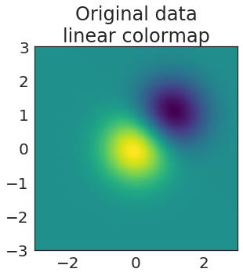
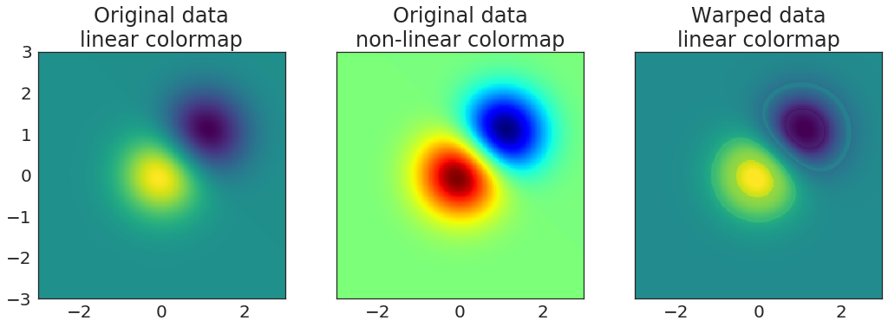
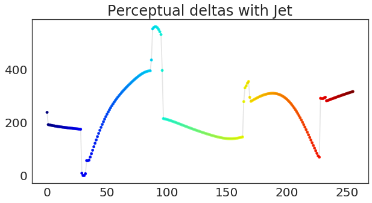
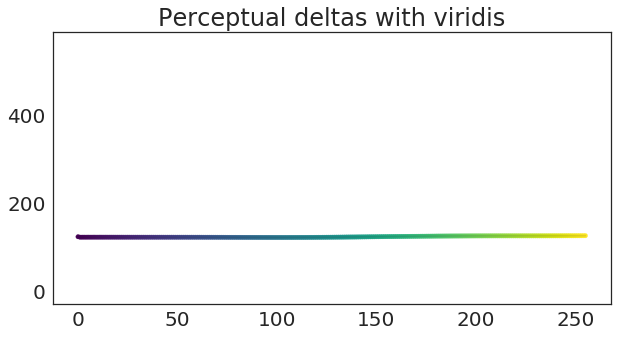
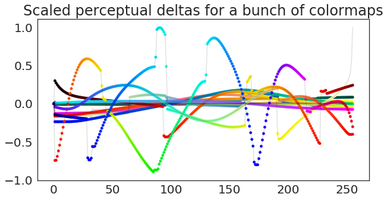
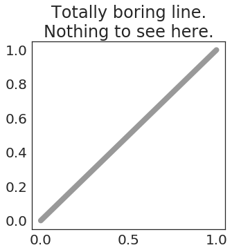
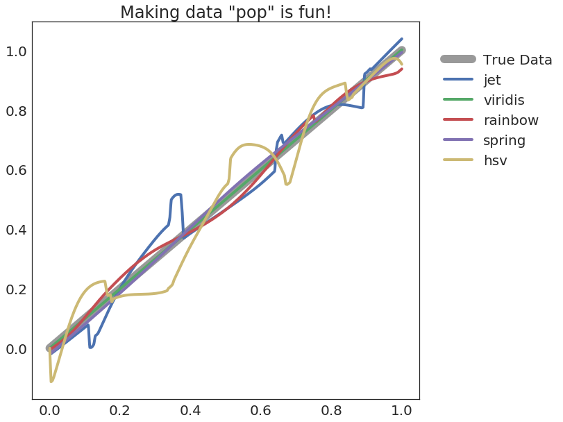
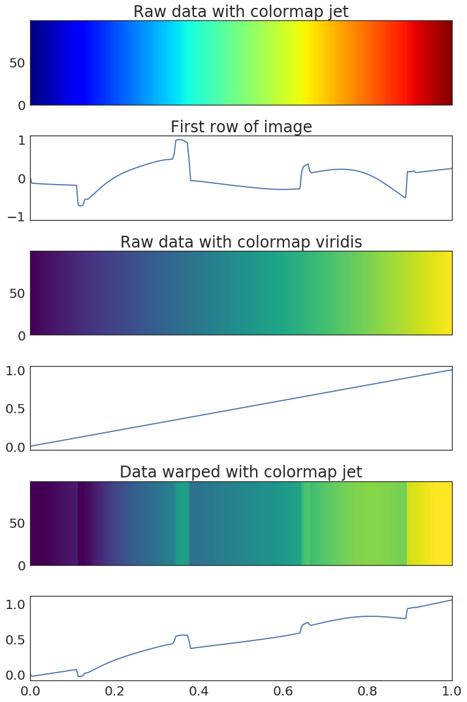

> *Note: It should go without saying, but **you should never do the stuff that you're about to read about here**. Data is meant to speak for itself, and our visualizations should accurately reflect the data above all else.*

When I was in graduate school, I tended to get on my soapbox and tell everybody
why they should [stop using Jet](http://jakevdp.github.io/blog/2014/10/16/how-bad-is-your-colormap/)
and adopt a "perceptually-flat" colormap like [viridis, magma, or inferno](https://bids.github.io/colormap/).

Surprisingly (ok, maybe not so surprisingly) I got a lot of pushback from people. Folks would say _"But I like **jet**, it really highlights my data, it makes the images 'pop' more effectively than viridis!"_.

Unfortunately it turns out that when a colormap "makes your data pop", it really just means "[warps your perception of the visualized data so that you see non-linearities when there are none](https://bids.github.io/colormap/)". AKA, a colormap like Jet actually _mis-represents_ the data.

But what does this really mean? It's difficult to talk and think about coor - especially when it comes to relating color with objective relationships
between data. Rather than talking about colormaps in the abstract, what if we could *visualize* the warping that is performed by colormaps like Jet?

In this post I'll show that this is possible! Introducing **`makeitpop`**.


## What does _makeitpop_ do?

Makeitpop lets you apply the same perceptual warping that would _normally_ be accomplished
with a colormap like Jet, but applies this warping to _the data itself_! This lets us
get the same effect with a nice linear colormap like `viridis`!

For example, let's take a look at the [image demo in matplotlib](https://matplotlib.org/gallery/images_contours_and_fields/image_demo.html#sphx-glr-gallery-images-contours-and-fields-image-demo-py). In it, we create two blobs that are meant to be visualized as an image. We'll visualize this with our old friend viridis.


<div class="input_area" markdown="1">

```python
# Create a mesh grid with two gaussian blobs
delta = 0.025
x = y = np.arange(-3.0, 3.0, delta)
X, Y = np.meshgrid(x, y)
Z1 = np.exp(-X**2 - Y**2)
Z2 = np.exp(-(X - 1)**2 - (Y - 1)**2)
Z = (Z1 - Z2) * 2

# Visualize it
fig, ax = plt.subplots(figsize=(5, 5))
ax.imshow(Z, cmap=plt.cm.viridis,
          origin='lower', extent=[-3, 3, -3, 3],
          vmax=abs(Z).max(), vmin=-abs(Z).max())
ax.set(title="Original data\nlinear colormap")
plt.tight_layout()
```

</div>





Hmmm, not too bad...but it's a bit _boring_, no? Why can't we make it snazzier? I know, let's use Jet!


<div class="input_area" markdown="1">

```python
# Visualize our data
fig, ax = plt.subplots(figsize=(5, 5))
ax.imshow(Z, cmap=plt.cm.jet,
          origin='lower', extent=[-3, 3, -3, 3],
          vmax=abs(Z).max(), vmin=-abs(Z).max())
ax.set(title="Original data\nnon-linear colormap")
plt.tight_layout()
```

</div>


Oooh now that's what I'm talking about. You can clearly see two peaks of significant results
at the center of each circle. Truly this is fit for publishing in _Nature_.

But...as you all know, this data only _looks_ better because we've used a colormap that distorts
our perception of the underlying data.

Let's illustrate this by **making it pop**!


<div class="input_area" markdown="1">

```python
# Pop the data!
Z_popped = makeitpop(Z, 'jet', scaling_factor=20)

# Visualize the warped data
fig, ax = plt.subplots(figsize=(5, 5))
ax.imshow(Z_popped, cmap=plt.cm.viridis,
          origin='lower', extent=[-3, 3, -3, 3],
          vmax=abs(Z).max(), vmin=-abs(Z).max())
ax.set(title="Warped data\nlinear colormap")
plt.tight_layout()
```

</div>


Excellent! We're using a nice, perceptually-flat colormap like viridis, but we've attained
an effect similar to the one that *Jet* would have created!

Now let's visualize all three next to each other so that we can see the total effect:


<div class="input_area" markdown="1">

```python
fig, axs = plt.subplots(1, 3, figsize=(15, 5), sharey=True)

kws_img = dict(extent=[-3, 3, -3, 3], origin='lower',
               vmax=abs(Z).max(), vmin=-abs(Z).max())

# Raw data with a perceptually-flat colormap
axs[0].imshow(Z, cmap=plt.cm.viridis, **kws_img)
axs[0].set(title="Original data\nlinear colormap")

# Raw data with a perceptually-distorted colormap
axs[1].imshow(Z, cmap=plt.cm.jet, **kws_img)
axs[1].set(title="Original data\nnon-linear colormap")

# Distorted data with a perceptually-flat colormap
axs[2].imshow(Z_popped, cmap=plt.cm.viridis, **kws_img)
axs[2].set(title="Warped data\nlinear colormap")

plt.tight_layout()
```

</div>





## Let's see it in the real world

Thus far I've been using toy examples to illustrate how makeitpop works. Let's see how
things look on an actual dataset collected in the wild.

For this, we'll use the excellent [nilearn](https://nilearn.github.io/) package. This has a
few datasets we can download to demonstrate our point. First we'll load the data and prep it:


<div class="input_area" markdown="1">

```python
from nilearn import datasets
from nilearn import plotting
import nibabel as nb

# Load a sample dataset
tmap_filenames = datasets.fetch_localizer_button_task()['tmaps']
tmap_filename = tmap_filenames[0]

# Threshold our data for viz
brain = nb.load(tmap_filename)
brain_data = brain.get_fdata()
mask = np.logical_or(brain_data < -.01, brain_data > .01)
```

</div>

Next, we'll create a "popped" version of the data, where we apply the non-linear warping
properties of *Jet* to our data, so that we can visualize the same effect in linear space.


<div class="input_area" markdown="1">

```python
# Create a copy of the data, then pop it
# We'll use a scaling factor to highlight the effect
brain_popped = brain_data.copy()
brain_popped[mask] = makeitpop(brain_popped[mask], colormap='jet', scaling_factor=75)
brain_popped = nb.Nifti1Image(brain_popped, brain.affine)
```

</div>

Now, I'll plot the results for each.

* First, we'll see the raw data on a linear colormap. This is the way we'd display the data to show the true underlying relationships between datapoints.
* Next, we'll show the same data plotted with *Jet*. See how many more significant voxels there are! (/s)
* Finally, we'll plot the "popped" data using a linear colormap (viridis). This accurately represents the underlying data, but the data _itself_ has been distorted!


<div class="input_area" markdown="1">

```python
for i_brain, name in [(brain, 'original'), (brain, 'original (jet)'), (brain_popped, 'popped brain')]:
    cmap = 'jet' if name == 'original (jet)' else 'viridis'
    plotting.plot_stat_map(i_brain, cmap=cmap, vmax=7, display_mode='x',
                           title=name, cut_coords=np.linspace(20, 50, 5, dtype=int))
```

</div>


As you can see, different kinds of results show up when your perception of the data is affected by the colormap.

## How does this work?

OK, so what is the black voodoo magic that makes it possible to "make your data pop"?

It all comes down to your visual system. I won't go into a ton of detail
because Nathaniel Smith and Stefan van der Walt [already gave a great talk about this](https://www.youtube.com/watch?v=xAoljeRJ3lU), however here is a lay-person's take:

When we use color to represent data, we are mapping a range of data values onto
a range of color values. Usually this means defining a min / max for our data, then mapping data
values linearly from 0 to 1, and finally mapping those values onto RGB values in a colormap.

Implicit in this process is the idea that stepping across our space in the _data_ equates to
an equal step in our _perception_ of the color that is then chosen. We want a one-to-one mapping between the two.

Unfortunately, this isn't how our visual system works.

In reality, our brains do all kinds of strange things when interpreting color. They are biased to detect changes between particular kinds of colors, and biased to miss the transition between others.

*Jet* uses a range of colors that highlight this fact. It transitions through colors such that _linear_ changes in our data are perceived as _nonlinear_ changes when we look at the visualization. That's what makes the data "pop".

## Perceptual "delta" curves

You can determine the extent to which a colormap "warps" your perception of the data by calculating the "perceptual deltas" as you move across the values of a colormap (e.g. as you move from 0 to 1, and their corresponding colors).

These deltas essentially mean "how much is the _next_ color in the colormap perceived as different from the _current_ color?" If your colormap is perceptually flat, the delta will be the *same* no matter where you are on the range from 0 to 1.

Let's see what the deltas look like for *Jet*:


<div class="input_area" markdown="1">

```python
def plot_colormap_deltas(deltas, cmap, ax=None):
    if ax is None:
        fig, ax = plt.subplots(figsize=(10, 5))
    xrange = np.arange(len(derivatives))
    sc = ax.scatter(xrange, deltas, c=xrange, vmin=xrange.min(), vmax=xrange.max(),
                    cmap=plt.cm.get_cmap(cmap), s=20)
    ax.plot(xrange, deltas, c='k', alpha=.1)
    return ax

ax = plot_colormap_deltas(derivatives['jet'].values, 'jet')
ylim = ax.get_ylim()  # So we can compare with other colormaps
ax.set(title="Perceptual deltas with Jet")
```

</div>


{:.output_data_text}
```
[Text(0.5,1,'Perceptual deltas with Jet')]
```





Oops.

As you can see, Jet does **not** have a flat line for perceptual deltas. Each "jump" you see above is a moment where Jet is actually _mis-representing_ differences in the data. For shame, Jet.

Now let's see what this looks like for viridis:


<div class="input_area" markdown="1">

```python
ax = plot_colormap_deltas(derivatives['viridis'].values, 'viridis')
ax.set(ylim=ylim, title="Perceptual deltas with viridis");
```

</div>





Ahhh, sweet, sweet linear representation of data.

In case you're curious, here are the "perceptual deltas" for several colormaps.
In this case, I've centered them and scaled each by the variance of the largest colormap,
so that they are easier to compare. 


<div class="input_area" markdown="1">

```python
fig, ax = plt.subplots(figsize=(10, 5))
for cmap, deltas in derivatives_scaled.items():
    if cmap == 'linear':
        continue
    ax = plot_colormap_deltas(deltas.values, cmap, ax=ax)
ax.set(title="Scaled perceptual deltas for a bunch of colormaps");
```

</div>





## We can even warp 1-dimensional data!

Let's see how this principle affects our perception with a different kind of visual
encoding. Now that we know these perceptual warping functions, we can get all the
data-warping properties of jet, but in one dimension!

Here's a line.


<div class="input_area" markdown="1">

```python
fig, ax = plt.subplots(figsize=(5, 5))
x = np.linspace(0, 1, 100)
ax.plot(x, x, 'k-', lw=8, alpha=.4, label='True Data')
ax.set_title('Totally boring line.\nNothing to see here.');
```

</div>





Ew. Boring.

Now, let's make it pop! We'll loop through a few colormaps, applying its color
warping function to the y-axis of our line as we step through it.


<div class="input_area" markdown="1">

```python
names = ['jet', 'viridis', 'rainbow', 'spring', 'hsv']
fig, ax = plt.subplots(figsize=(10, 10))

x = np.linspace(0, 1, 1000)
ax.plot(x, x, 'k-', lw=12, alpha=.4, label='True Data')
for nm in names:
    ax.plot(x, makeitpop(x, colormap=nm, scaling_factor=40), label=nm, lw=4)
    ax.legend(loc=(1.05, .6))
ax.set_title('Making data "pop" is fun!')
```

</div>


{:.output_data_text}
```
Text(0.5,1,'Making data "pop" is fun!')
```





As you can see, data looks much more interesting when it's been non-linearly warped!
It looks particularly striking when you see it on a 1-D plot. This is effectively
what colormaps such as Jet are doing in 2 dimensions! We're simply bringing the fun
back to 1-D space.

Let's see how it looks on some scatterplots. We'll plot the raw data in the background in grey,
and the "popped" data in front in color. Notice how some colormaps distort the y-values more
than others.


<div class="input_area" markdown="1">

```python
names = ['viridis', 'jet', 'rainbow', 'spring', 'hsv']
fig, axs = plt.subplots(1, len(names), figsize=(20, 4), sharex=True, sharey=True)
x = np.linspace(0, 1, 100)
y = x + np.random.randn(len(x)) * .2
for name, ax in zip(names, axs):    
    ax.scatter(x, y, c='k', s=80, alpha=.2)
    ax.scatter(x, makeitpop(y, name, 40), c=y, s=40, alpha=.8, cmap=plt.get_cmap(name))
    ax.set(title=name)

```

</div>


## So what should we do?

The reason that I wrote this blog post (and made this silly package) is to illustrate what we're really
doing when we use a colormap like *Jet*, and to highlight the importance of using a perceptually-flat colormap.  Sure, we want to choose the visualization that best-makes our point,
but a colormap like Jet is _actively mis-representing your data_. You'd _never_ consider changing the raw
data values so that an effect popped out, and you'd _never_ alter the y-values of a scatterplot so that something shows up. Well, this is perceptually what you're doing when you visualize 2-D data with Jet.

Here are a few things to keep in mind moving forward:

* Don't use Jet
* If you review a paper or are an editor for a journal, consider asking authors to use a perceptually flat colormap (this is usually just a matter of changing `cmap='viridis'`!)
* Be aware of the effects that color has on the point you're trying to make. Perceptual warping is
  just one of many potential issues with choosing the right color.

## Wrapping up

I hope that this post has been a fun and slightly informative take on the nuances of colormaps, and the unintended effects that they might have.

So, `tl;dr`:

* Jet (and many other colormaps) mis-represent your perception of the data
* Perceptually flat colormaps like Viridis, Magma, Inferno, or Parula minimize this effect
* You can calculate the _extent_ to which this mis-representation happens as you move along the colormap
* We can then use this function to _distort_ data so that the data itself contains this mis-representation
* But doing so would be super unethical, so in the end **you should stop using jet and use a perceptually-flat colormap like viridis.**


If you'd like to check out the `makeitpop` package, see the [GitHub repo here](https://github.com/choldgraf/makeitpop). In addition, all of the examples in this post are runnable
on Binder! You can launch an interactive session with this code by clicking on the Binder button
at the top of this page!

## Addendum: Ok but how does `makeitpop` _actually_ work?

In this section I'll describe the (admittedly hacky) way that I've written `makeitpop`.
As I mentioned before, [all the `makeitpop` code is on GitHub](https://github.com/choldgraf/makeitpop) and
Pull Requests are more than welcome to improve the process (I'm looking at you, "histogram matching" people!)

Here's what `makeitpop` does:

1. Collects a list of the "perceptual deltas". These are calculated from the equations given in [`viscm`](https://github.com/matplotlib/viscm), which was released as a part of the original work that created `viridis`.
2. Centers each colormap's deltas at 0.
3. Scales each colormap's deltas by the _largest variance_ across all colormaps. This is to make sure that warping the data is done with the relative differences of each colormap in mind.
4. When `makeitpop` is called, the function then:
    1. Scales the input data linearly between 0 and 1
    2. Calculates the point-by-point derivative for linearly spaced points between 0 and 1 (the derivative is the same for all points here).
    3. Multiplies each derivative by the scaled perceptual deltas function, plus an extra scaling factor that accentuates the effect.
    4. Adds each value to the scaled input data.
    5. Un-scales the altered input data so that it has the same min/max as before.
    
There are plenty of ways you could do this more effectively (for example, by matching empirical CDFs and
using linear interpolation to map the delta function of one colormap onto the delta function for another
colormap). If you'd like to contribute or suggest something, feel free to do so! However, I'm just creating
this package to highlight an idea, and think this approach gets close enough with relatively little complexity.


# Some extras

Here's a viz that will let you visualize how different colormaps distort data. We'll show a
gradient of linearly-spaced values, both using a warping colormap such as "jet" and a linear
colormap like "vidiris". Then, we'll "pop" the data and re-visualize with viridis.


<div class="input_area" markdown="1">

```python
# Create a gradient of datapoints
data = np.linspace(0, 1, 256)
data = np.tile(data, [100, 1])

# Pop the data
cmap_warping = 'jet'
scaling_factor = 50
data_popped = makeitpop(data, cmap_warping, scaling_factor)

# Visualize
fig, axs = plt.subplots(6, 1, figsize=(10, 15), sharex=True)
axs[0].pcolormesh(derivatives_scaled.index, range(len(data)), data, vmin=0, vmax=1, cmap=cmap_warping)
axs[0].set(title="Raw data with colormap {}".format(cmap_warping))
axs[1].plot(derivatives_scaled.index, derivatives_scaled[cmap_warping].values)
axs[1].set(xlim=[0, 1], ylim=[-1.1, 1.1], title="First row of image")

axs[2].pcolormesh(derivatives_scaled.index, range(len(data)), data, vmin=0, vmax=1, cmap='viridis')
axs[2].set(title="Raw data with colormap {}".format('viridis'))
axs[3].plot(derivatives_scaled.index, data[0])
axs[3].set_xlim([0, 1])

axs[4].pcolormesh(derivatives_scaled.index, range(len(data)), data_popped, vmin=0, vmax=1, cmap='viridis')
axs[4].set(title="Data warped with colormap {}".format(cmap_warping))
axs[5].plot(derivatives_scaled.index, data_popped[0])
axs[5].set_xlim([0, 1])
plt.tight_layout()
```

</div>





And here's a little interactive widget to visualize how the scaling factor affects the "pop" effect.


<div class="input_area" markdown="1">

```python
from ipywidgets import interact, IntSlider, Dropdown

def viz(scaling_factor, cmap):
    fig, axs = plt.subplots(1, 2, figsize=(10, 5))
    Z_popped = makeitpop(Z, cmap, scaling_factor=scaling_factor)

    axs[0].imshow(Z, cmap=plt.get_cmap(cmap),
          origin='lower', extent=[-3, 3, -3, 3],
          vmax=abs(Z).max(), vmin=-abs(Z).max())
    axs[0].set(title="Original data\ncolormap: {}".format(cmap))
    axs[1].imshow(Z_popped, cmap=plt.cm.viridis,
              origin='lower', extent=[-3, 3, -3, 3],
              vmax=abs(Z).max(), vmin=-abs(Z).max())
    axs[1].set(title="Warped like: {}\ncolormap: viridis".format(cmap))
    plt.show()
interact(viz, scaling_factor=IntSlider(1, 1, 80),
         cmap=Dropdown(options=derivatives_scaled.columns.values, value='jet'))
```

</div>


{:.output_data_text}
```
interactive(children=(IntSlider(value=1, description='scaling_factor', max=80, min=1), Dropdown(description='c…
```


{:.output_data_text}
```
<function __main__.viz(scaling_factor, cmap)>
```


